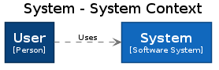
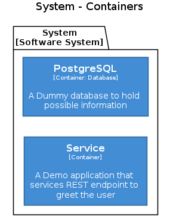
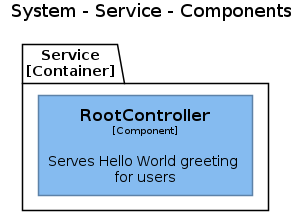

# Architecture diagrams

Architecture is visualized on multiple levels according to a [C4 Model](https://c4model.com/). Diagrams are created as Documentation-as-a-Code. They are written in Structurizr DSL and automatically generated and uploaded into documentation. This way all changes to the architecture can be easily traced back.

## System context diagram (C1)

## Container diagram (C2)

## Component diagram (C3)

